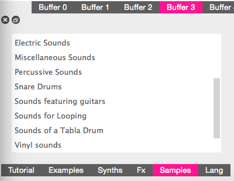

# Week 2 

___

Recap from last week:
* Going over syntax of Sonic Pi
* MIDI notes 
* Loops

___

This week on.. DUN DUN DUN... Sonic Pi!
We'll start with some Samples, Synths, and THREADS!!

I learned that samples are technically related to loops as in they come in a custom folder that Sonic Pi gives you.
Basically it's a library of looped sounds that can be used for a background beat.
 

 
^ This is the most helpful thing to have because when you don't remember samples or synths, they're here for you.