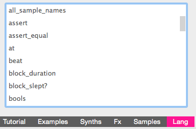

# Week 4 
___

Going over some attacks, releases, and Lang
 ___
 
 ### *Lang*
 
 
So basically what I found out when I was tinkering is to use something useful called *Lang*. It's just a little "cheatsheet" with definitions and examples of code you might need in the future.
 
 

This has all syntax in Sonic pi and will save your life!

 ### *Attack*
 
 

### Takeaways
====================

- One takeaway I learned was to use cheatsheets to your advantage. I looked forever for something called *.choose*. Googleing like I'm supposed to do with anything I dont know, nothing came up. Until... Lang came 

### Challenges
====================

